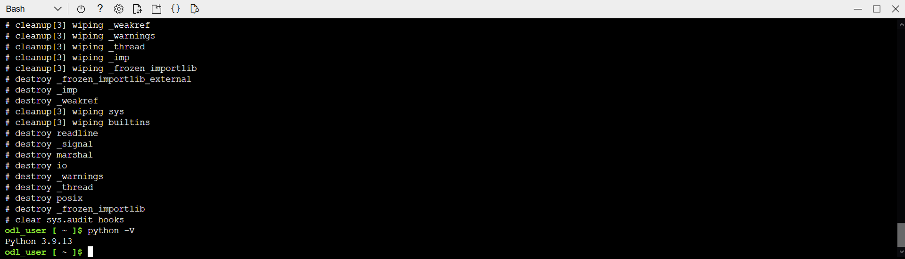
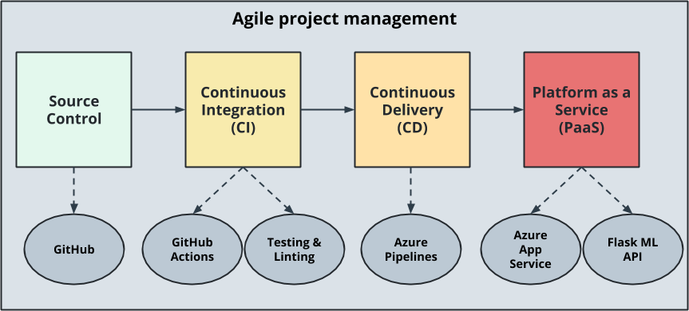
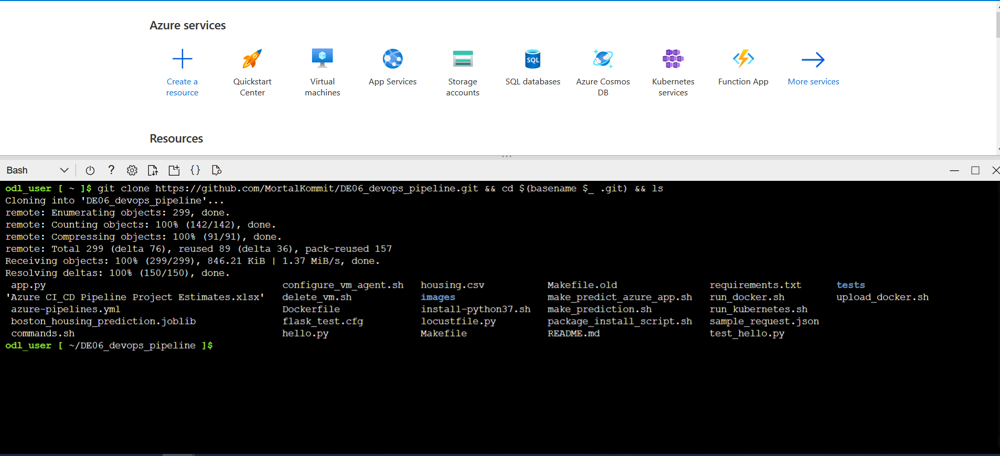
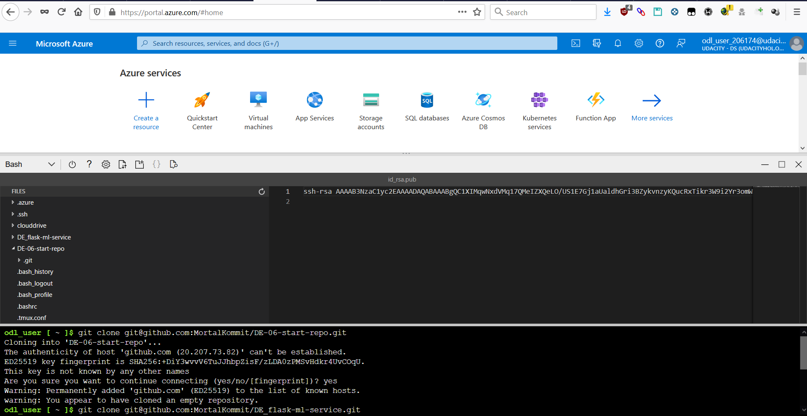

# Project 06 : Building a CI/CD Pipeline in Azure

## Overview

This project creates a Continuous Integration/Continuous Delivery pipeline in Microsoft Azure from scratch following the Agile project management strategy.  
In the first phase, under Agile Planning, tasks and features(stories) are listed and categorized with relevant tools.
In Continuous Integration, tools that check and test code for errors are used.
Finally in Continous Delivery, usage of the GitOps paradigm is explored, with tooling that help build and deploy applications in cloud-native environments.


## Project Plan

### Agile Planning
* [Public Trello Planning Board](https://trello.com/b/kMLggxDk/data-engineer-project-6-ci-cd-pipeline-in-azure)
* [Google Sheets Link](https://docs.google.com/spreadsheets/d/1T-81GkagNErgDYWhceByO3krUganOfq5i20evQmcKzU/edit?usp=sharing)

The plan for this project initially included simple setup and deployment of the app. However, as a result of Azure deprecating support for older versions of Python  
in Azure shell, the default version of python was changed to python 3.9.


This caused issues with running the project in the Azure shell environment, so a separate pre-compiled version of python had to be configured (due to a lack of privileges to run apt-get) to get the webapp running, using a miniconda distribution.

## Instructions


The diagram shows the sequence of steps in the construction of the project. Code checked into source control, with git is the base  
of the application. The code is pushed to a remote repository provider, in this case GitHub, which triggers the pipeline to be run on a "push" event.  
For the step of Continuous Integration, a Makefile is created with steps to lint and test the application. The Makefile defines a series of steps to be followed and represent a crude version of the pipeline build. By integrating the Makefile with GitHub Actions, we
pass the steps in the Makefile as build steps to the pipeline. The pipeline shows a successful build if the relevant make steps return exit status codes of 0 if they ran without error.  
In the Continuous Delivery step, the repository on GitHub is connected with Azure Pipelines to generate the built package (zip or archive) after a successful build. This pipeline should connect to a pre-defined Azure webapp and deploy and update the code there.  
Confirmation that the deployment worked successfully is done by making a POST request, passing input parameters in JSON and receiving a prediction response.

  
The image above represents the scaffolding of the project. In the first step, code in GitHub is cloned into the Azure cloud shell environment, and the webapp is run in the Azure Cloud Shell environment. 



A public project may be cloned directly with the URL, however a private project can be cloned by adding the public key of a Shell-generated key (via ssh-keygen) to the Github repo, as shown in the image below. The ssh-keygen creates a public-private string keypair in the .ssh/ HOME folder of the current user.




* Project running on Azure App Service

* Passing tests that are displayed after running the `make all` command from the `Makefile`

* Output of a test run

* Successful deploy of the project in Azure Pipelines.  [Note the official documentation should be referred to and double checked as you setup CI/CD](https://docs.microsoft.com/en-us/azure/devops/pipelines/ecosystems/python-webapp?view=azure-devops).

* Running Azure App Service from Azure Pipelines automatic deployment

* Successful prediction from deployed flask app in Azure Cloud Shell.  [Use this file as a template for the deployed prediction](https://github.com/udacity/nd082-Azure-Cloud-DevOps-Starter-Code/blob/master/C2-AgileDevelopmentwithAzure/project/starter_files/flask-sklearn/make_predict_azure_app.sh).
The output should look similar to this:

```bash
udacity@Azure:~$ ./make_predict_azure_app.sh
Port: 443
{"prediction":[20.35373177134412]}
```

* Output of streamed log files from deployed application

> 

## Enhancements

<TODO: A short description of how to improve the project in the future>

## Demo 

<TODO: Add link Screencast on YouTube>


