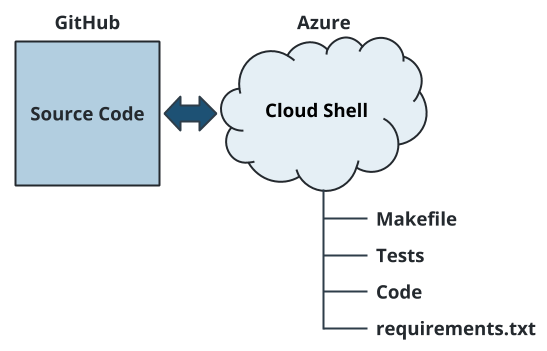
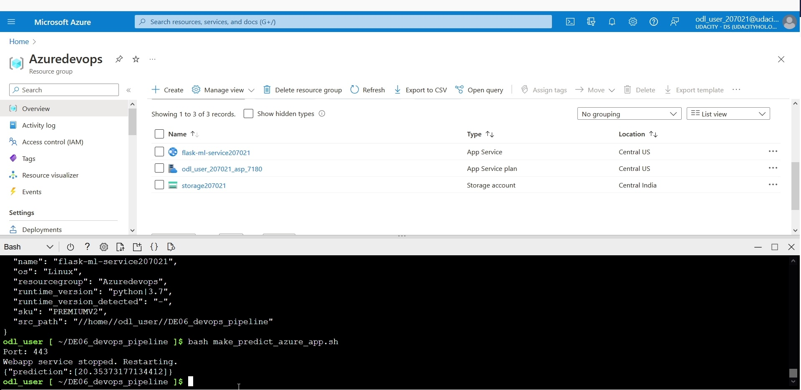

# Project 06 : Building a CI/CD Pipeline in Azure

## Overview

This project creates a Continuous Integration/Continuous Delivery pipeline in Microsoft Azure from scratch following the Agile project management strategy.  
In the first phase, under Agile Planning, tasks and features(stories) are listed and categorized with relevant tools.
In Continuous Integration, tools that check and test code for errors are used.
Finally in Continous Delivery, usage of the GitOps paradigm is explored, with tooling that help build and deploy applications in cloud-native environments.


## Project Plan

### Agile Planning
* [Public Trello Planning Board](https://trello.com/b/kMLggxDk/data-engineer-project-6-ci-cd-pipeline-in-azure)
* [Google Sheets Link](https://docs.google.com/spreadsheets/d/1T-81GkagNErgDYWhceByO3krUganOfq5i20evQmcKzU/edit?usp=sharing)

If the Google Sheets Link is unavailable, a copy of the sheet is available in excel format named `Azure CI_CD Pipeline Project Estimates.xlsx`.  
The plan for this project initially included simple setup and deployment of the app. However, as a result of Azure deprecating support for older versions of Python  
in Azure shell, the default version of python was changed to python 3.9.


This caused issues with running the project in the Azure shell environment, so a separate pre-compiled version of python had to be configured (due to a lack of privileges to run apt-get) to get the webapp running using a miniconda distribution.

## Instructions

### Architecture Diagram

The diagram shows the sequence of steps in the construction of the project. Code checked into source control, with git is the base  
of the application. The code is pushed to a remote repository provider, in this case GitHub, which triggers the pipeline to be run on a "push" event.  
For the step of Continuous Integration, a Makefile is created with steps to lint and test the application. The Makefile defines a series of steps to be followed and represent a crude version of the pipeline build. By integrating the Makefile with GitHub Actions, we
pass the steps in the Makefile as build steps to the pipeline. The pipeline shows a successful build if the relevant make steps return exit status codes of 0 if they ran without error.  
In the Continuous Delivery step, the repository on GitHub is connected with Azure Pipelines to generate the built package (zip or archive) after a successful build. This pipeline should connect to a pre-defined Azure webapp and deploy and update the code there.  
Confirmation that the deployment worked successfully is done by making a POST request, passing input parameters in JSON and receiving a prediction response.

### Project Code
  
The image above represents the scaffolding of the project. In the first step, code in GitHub is cloned into the Azure cloud shell environment, and the webapp is run in the Azure Cloud Shell environment. 


A public project may be cloned directly with the URL, however a private project can be cloned by adding the public key of a Shell-generated key (via ssh-keygen) to the Github repo, as shown in the image below. The ssh-keygen creates a public-private string keypair in the .ssh/ HOME folder of the current user.


### Running the Code
The Flask app can be deployed on Azure app service manually by running the command. The app can then be tested in the Azure Cloud Shell environment by running make_predict_azure_app.sh.
```
bash commands.sh && \
bash make_predict_azure_app.sh
```
The screenshot below shows the running Azure App Service, along with a prediction.


The `commands.sh` shell script should automatically run make all, however from cloud shell, GNU make can also be run as 
```
make all
```
which should display results similar to the screenshot below. Note that the repository has been renamed (earlier named DE-06-start-repo), and a few more tests have been added since the screenshot.  


### Configuring the Build Agent
The build agent is a server program that builds the code, runs tests and steps defined in a config file and creates artifacts (zip/tar) from the project.  
Azure provides a default build agent, however this option is unavailable while using the Udacity Cloud Lab.  
In this case, a self-hosted agent can be used.  
A virtual machine will have to be created, software packages installed to the VM and it will have to run the build agent configuration scripts.  

Keeping in mind the spirit of 'Ruthless Automation', I have pre-configured the creation of the VM, creation of the web app, and setup of build agent scripts in a pre-defined bash script, that requires minimal input.  
Users are prompted for input only while remoting to the the machine via SSH and for providing the Personal Access Token(PAT).  

As a pre-requisite of running this script, a service connection using the Azure Resource Manager Service Principal, 
a PAT, and an agent pool called `vmAgentPool` need to be created. A resource group named `Azuredevops` must also exist.
This script can be run with the command 
```
bash configure_vm_agent.sh
```
and it will create a self-hosted Ubuntu VM agent with python 3.7 installed. The script is very resilient and has retry attempts in case the SSH command fails, and has been tested intensively.  

### Configuring GitHub Actions and Azure Pipelines

The GitHub actions yaml should be present in `.github/workflows/actions.yml` and consists of the steps to build the project in 
GitHub. Choose the template option of Python app while configuring actions for the first time.  
The output of a GitHub Actions pipeline run is shown below.  
  


The final step is the configuration and deployment of the webapp in Azure pipelines. Use the provided azure-pipelines.yml file to configure  
the Azure devops pipeline. Note that the Agent Pool name and web app service name are configured as environment variables to the pipeline  
with the name `$poolName` and `$webServiceAppName`. The values for these need to be set as `vmAgentPool` and the name of the Azure webapp service.  
If configured correctly, the Azure pipelines should show a successful build, with all steps passing.
.

Once the pipeline has deployed to Azure App Service successfully, a prediction can be made by running the make_predict_azure_app.sh bash script, 
```
bash make_predict_azure_app.sh
``` 
which should return a floating point value JSON response.


Each request made to the webapp should show up as an entry in the log stream of Azure App Service.


### Notes
The following features have been added to the current version of this project, in addition to the functionality described above:
- Better written tests with pytest that use fixtures and validate responses, by spinning up the server during the test step
- Addition of load test step with locust, in headless mode which is also configured in the Makefile and defines upto 10 users that   
gradually ramp up and hit the /predict endpoint in randomized wait time periods. The step fails if failure rate exceeds a threshold of 5 %.  

## Enhancements  

Possible enhancements for the project, in presumed increasing order of difficulty include:
 - Direct deployment from GitHub Actions to Azure WebApp Service
 - Deploy docker image to Azure webapp, would require Azure Container Registry
 - Deploy to kubernetes cluster, would require Azure Container Registry and Azure Kubernetes Service
 - Addition of better validation and usage of FastAPI or the Falcon framework  which would increase speed of the webapp.
 - Queueing of requests to serve larger number of users 

## Demo 

Please use the code walkthrough listed below and follow along as you run the commands, and configure the CI/CD pipeline for this project. The thumbnail is clickable, and links to the youtube-hosted video for the project.

[](https://youtu.be/UumZwrlamqg "CI/CD Pipeline Code Walkthrough")  

